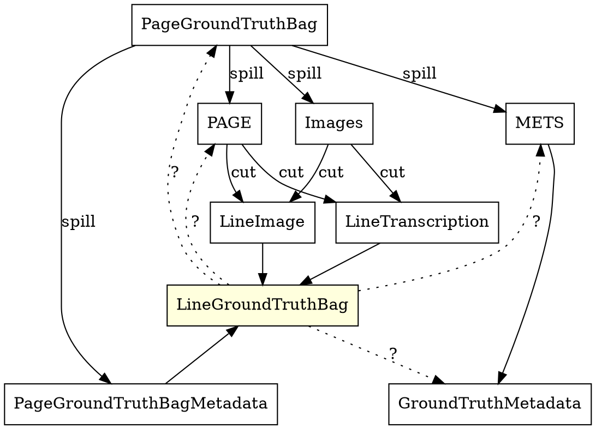

# okralact - Foundations of a turn-key multi-engine Open Source OCR training infrastructure

## Abstract

With the technologies around optical character recognition (OCR) embracing
Deep Learning with neural networks (NN), there have been various efforts to develop
Free Software OCR engines that can be adapted to different types of documents by
training specific models based on manually labeled ground truth (GT). What these
engines offer in terms of implementation finesse they lack in interoperability
and standardization. In this paper, we present okralact, a set of specifications
and a prototypical implementation of an engine-agnostic framework for training
Open Source OCR engines like tesseract, ocropus, kraken or calamari. We briefly
compare these engines, describe the specifications and software we have been
developing and outline the challenges in and our plans to contribute to
a more accessible and interoperable Open Source OCR ecosystem.

## Intro

The rise of Deep Learning in the last decade has been a game-changer for image
processing, text recognition and layout analysis, the key parts of optical
character recognition (OCR) workflows. The text recognition technology in
particular has seen a paradigm-shift, away from a combination of character
segmentation and pattern-based detection, towards segmentation-free recognition
based on trained neural networks (NN). Any NN-based approach involves two
steps: Training a model based on manually annotated ground truth (GT) and
applying this model to data, in the case of OCR to recognize the text in
images.

## Open Source OCR

| Engine       | Main Developer     | Number of contributors | First Release | GitHub Stars | Stack               | License    |
| ---          | ---                | ---                    | ---           | ---          | ---                 | ---        |
| OCRopus      | Tom Breuel         | 28                     | 2010          | 2557         | Python              | Apache 2.0 |
| kraken       | Benjamin Kiessling | 10                     | 2015          | 146          | Python + Torch      | Apache 2.0 |
| Calamari OCR | Christoph Wick     | 7                      | 2018          | 299          | Python + Tensorflow | Apache 2.0 |
| tesseract    | Ray Smith          | 102                    | 1985          | 27135        | C++                 | Apache 2.0 |

* List ocropy, kraken, calamari, tesseract
* Different engines or different models useful for different purposes - open question!
* Effectively comparing/evaluating is hard, because unstardadized
    * Input (GT)
    * Output (models)
    * interfaces for training, evaluation
* => Need for common specs and 
    
## Common API, training/line gt specs

* Common parameters
* JSON schemas
* documentation
* integration into OCR-D "framework"

## okralact - the prototype

* software stack (python, flask, redis, jsonschema...)
* Components
    * Training
    * Recognition
    * Evaluation
* HTTP API with message exchange samples
* Essential part of OCR-D, open source, maintained etc.

## Challenges & Future Work

* Cooperate with engine developers - standardization benefits all
* Further refinements to support more complex training scenarios
* Basic performance metrics / engine comparison

---

# OLD OLD OLD OLD OLD OLD OLD OLD OLD OLD OLD OLD OLD OLD OLD OLD OLD OLD OLD OLD OLD OLD OLD OLD OLD OLD OLD OLD OLD OLOLD OLD OLD OLD OLDD OLD OLD OLD OLD OLD OLD OLD OLD OLD OLD OLD OLD OLD OLD OLD OLD OLD OLD OLD OLD OLD OLD OLD OLD OLD OLD OLD OLD OLD OLD OLD OLD OLD OLD OLD OLD OLD OLD OLD OLD

---

# mollusc paper

* Taming cephalopods/mollusc: A multi-engine training infrastructure for deep-learning at scale

## URLs

* https://github.com/OCR-D/ocrd-train
* https://github.com/OCR-D/ocropy/tree/py3-again
* https://pypi.org/project/ocrd-fork-ocropy/

## Premise

* Unified format for GT ready for training by engines
  * line transcriptions and images
  * provenance metadata
* Run different engines with the same configuration
* Analyze output
* Run with evaluation set
  * Character Error Rate / Accuracy
  * Levenshtein distance
  * Word error rate
  * <del>Line error rate</del>
  * Checkpoints
  * ???
* Compare results / graph CER
* Allow training config to specify exactly what is training, test and validation data
    * test data: what engines use for steering training
    * validation data: used after training to check for overtraining etc.

Focus on kraken in the prototype
    
    
Configuration otions:

  * learning rate

Warn user if training loss is stable or increasing after a few iterations/epochs and suggest adapting parameters (learning rate)

## Architecture

### Backend

Every engine has two parts:

* Trainer: Wrapping the training tool
* Recognizer: Wrapping the recognition/prediction tool

@rui: Recognition or Prediction?

Engines are managed by an engine manager that spawns new processes and manages a queue of running processes.

Processes are encapsulated as sessions, to be serialized and communicated via RESTful HTTP API.

HTTP API also for storing ground truth bags.

Vue.JS based User Interface

## Ground Truth and data

Ground Truth for three purposes

* Training the engine
* Steering the training
* Validating the training

Split the data to training_all/test data
Further split training_all data into training /validation data
1) Train the model on training data.
2) After each epoch of training, use validation data to validate whether the model is trained enough:
  * If the validation error is not  changing too much between continuous epoches,  or if  the validation error is  increasing, then stop training.
  * Else  continue  training.
After training is stopped, use test data to evaluate the trained model .

## Evaluation

The preformance of OCR engines is evaluated by aligning the OCR output with ground-truth and compute the [levenshtein distance][1] (or edit distance) between them, i.e., the minimal number of insertions, deletions and substitutions needed to transform the OCR output to the ground-truth. 

Then the character error rate (CER) could be computed as:
$$
\begin{align}
\textit{CER} = (i^c + s^c + d^c) / n^c
\end{align}
$$
where $i^c$  is the number of insertion errors, $s^c$  is the number of substituion errors, $d^c$ the number of deletion errors and $n^c$ the total number of characters. 

Similarly, the word error rate (WER) could be computed as:
$$
\begin{align}
\textit{WER} = (i^w + s^w + d^w) / n^w
\end{align}
$$
The word error rate is strongly correlated to the character error rate. It provid complementary information to the chracter error rate like how the character errors are distributed. For example, if two OCR engines have similar character error rate but one has lower word error rate, it means that the errors made by this engine are more concentrated in smaller number of words. It is also an important metric for downstream tasks, e.g., information retrieval, where a whole word is needed to be correct to be matched.

We compute both the micro-average and the macro-average of the error rates. Suppose we have $K$ pairs of OCR output and ground-truth to evaulate, the micro-average of character error rate is computed as following:
$$
\begin{align}
\textit{micro-avg}\_\textit{CER} = \frac{\sum_{k=1}^K(i^c_k + s^c_k + d^c_k)}{\sum_{k=1}^Kn^c_k}
\end{align}
$$
where $i^c_k$, $s^c_k$, $d^c_k$ are the number of different errors in the $k^{th}$ OCR line, and $n^c_k$ is the number of characters in the groundtruth of the $k^{th}​$ line.

The macro-average of character error rate is computed as:
$$
\begin{align}
\textit{macro-avg}\_\textit{CER} = \frac{1}{K}\sum_{k=1}^K\frac{(i^c_k + s^c_k + d^c_k)}{n^c_k}
\end{align}
$$
The micro-average error rate reflect the overall error rate for the whole corpus, while the macro-averaged error rate tells the average performance of the OCR engine across all the lines.


## Webservice

Bundle in one bag?

```sequence
client->ws: POST /training {engine:kraken...}
ws->backend: Create session 1
ws->client: 201 Location /training/1
client->ws: PUT /training/1/start
ws->backend: Start session 1
```


## Line Ground Truth from Page Ground Truth


[1]: https://en.wikipedia.org/wiki/Levenshtein_distance

Engine    & Main Developer     & Stack                      & License    & Development \\ \hline
OCRopus   & Tom Breuel         & Python                     & Apache 2.0 & stale       \\
kraken    & Benjamin Kiessling & Python \newline Torch      & Apache 2.0 & active      \\
Calamari  & Christoph Wick     & Python \newline Tensorflow & Apache 2.0 & active      \\
tesseract & Ray Smith          & C++                        & Apache 2.0 & active
